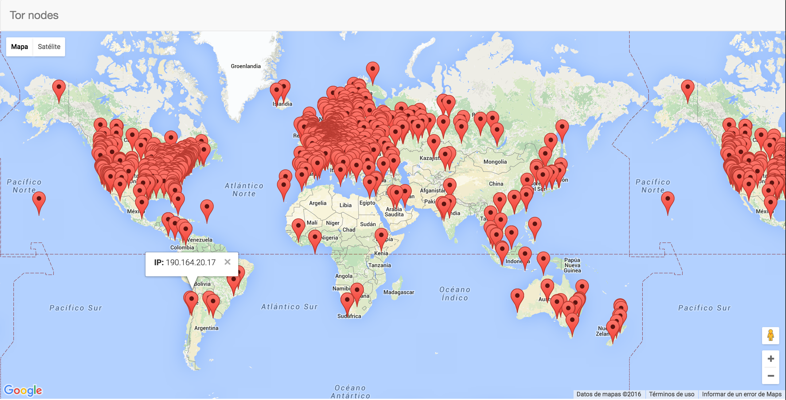

# tor-nodes-map

Project showing the location of nodes in the Tor network on a map. The nodes information is updated every 3h from [https://torstatus.blutmagie.de/index.php](https://torstatus.blutmagie.de/index.php)



# Installation

## Install dependencies

    pip install TorNodesMap/requirements/production.txt

## Postgres database and PostGIS
```
#!bash

sudo -u postgres createuser #USER_NAME
sudo -u postgres createdb -O #USER_NAME #DB_NAME
```

### PostGIS extension

```
#!bash

psql #DB_NAME
CREATE EXTENSION postgis;
```
## Settings django

Create new file **TorNodesMap/TorNodesMap/settings/local.py**
```
#!python

DATABASES = {
    'default': {
        'ENGINE': 'django.contrib.gis.db.backends.postgis',
        'NAME': '#DB_NAME',
        'USER': '#USER_NAME',
        'PASSWORD': '#DB_PASSWORD',
        'HOST': '#POSTGRES_HOST',
        'PORT': '#POSTGRES_PORT',
    }
}

DEBUG = True
```

## Run migrations
```
#!bash

python manage.py migrate
```

## Feed the database with tor nodes
```
#!bash

python manage.py get_tor_nodes_data
```

## Run 
```
#!bash

python manage.py runserver 0.0.0.0:8000
```
